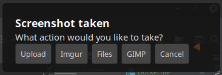

# Screenshot Notification Actionable-Program Solution

SNAPS uses the notification system to prompt users for an action post-screenshot. 



When the bound hotkey that initiates the script is pressed, `scrot` is executed in selection mode.
After selecting part of the screen, a notification appears with buttons asking what action to execute next.

**Default actions include:**

* Upload (uses scp configured in the config.ini)
* Upload to imgur
* Open with file manager (default Thunar)
* Open with GIMP
* Cancel


## Requirements

Install `scrot` and [PyGObject](https://pygobject.readthedocs.io/en/latest/getting_started.html).

### Debian/Ubuntu

```
sudo apt-get install scrot python3-gi python3-gi-cairo gir1.2-gtk-3.0
```

### Redhat/Fedora

```
sudo dnf install scrot python3-gobject gtk3
```

### Other

Read the PyGObject above, and install scrot.


## Install

```
make install
```

If installed outside a venv, ensure the installed package location is in your path:

e.g. `PATH="$PATH:$HOME/.local/bin"` in your shell runtime configuration.

## Configuration

An example configuration file will be copied to `~/.config/snaps/config.ini` on first run.

The configuration contents should appear similar to below:

```
[default]
log_level = INFO

local_screenshot_path = ~/screenshots/clippings/

# File browser
file_browser = thunar

# Web browser
web_browser = chromium-browser

# SCP
remote_screenshot_path = ~/web.example.com/html/screenshots/
remote_user = user
remote_server = ssh.example.com
remote_server_url = http://example.com/screenshots/

# To use imgur: https://api.imgur.com/oauth2/addclient
imgur_client_id = xxxxxxxxxxxxxxx
api_key = xxxxxxxxxxxxxxxxxxxxxxxxxxxxxxxxxxxxxxxxx
```

In order to scp without a password, you'll need to copy your ssh key over
 to your server.

```
ssh-copy-id user@server
```

## Usage

Run SNAPS using the command:

```
snaps --help
```

Or call the `cli.py` file directly

```
python3 src/cli.py
```

## Tests

```
make tests
```

In docker:

```
xvfb-run -a make tests
```